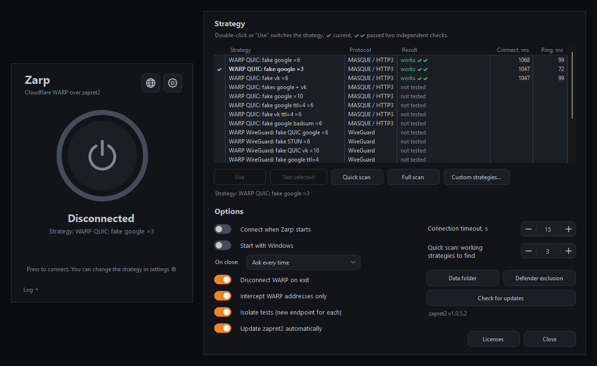

# Zarp

[](https://github.com/feg55/Zarp/actions/workflows/build.yml)
[](https://github.com/feg55/Zarp/releases/latest)
[](LICENSE)

One-click Cloudflare WARP for networks that block it. Zarp finds a [zapret2](https://github.com/bol-van/zapret2) strategy that gets the WARP handshake through DPI, remembers it and connects.



## Features

- **One button.** The first click searches for the fastest working strategy, later clicks connect right away.
- **Built for WARP.** Strategies target the WARP handshake only: MASQUE over QUIC, WireGuard and the MASQUE HTTP/2 fallback.
- **Honest testing.** Each test runs against a fresh WARP endpoint and every candidate is verified twice. A strategy that only passed thanks to a previous connection is thrown out.
- **Self-healing.** If the saved strategy stops working, Zarp tries the other verified ones before searching again.
- **Zero setup.** A single `Zarp.exe` with zapret2 embedded. zapret2 updates itself in the background.
- **Low overhead.** Only WARP addresses and handshake packets are intercepted. The tunnel itself never passes through zapret.

## Requirements

- Windows 10 or 11, x64
- [Cloudflare WARP](https://one.one.one.one/) (`winget install Cloudflare.Warp`)
- Administrator rights (needed by the WinDivert driver)

## Usage

1. Download `Zarp.exe` from [Releases](https://github.com/feg55/Zarp/releases/latest) and run it.
2. Press the power button. The first search takes a minute or two.
3. Done. Change the strategy any time in Settings.

> [!NOTE]
> **"Windows protected your PC"?** `Zarp.exe` is not code-signed yet, so SmartScreen warns about every new release until it builds up reputation. Click **More info → Run anyway**, or check the file first (see [Verify the download](#verify-the-download)).

> [!NOTE]
> Turn off any other VPN (Happ, v2rayN, Clash, AmneziaVPN, ...). WARP traffic would go through its tunnel instead and no strategy would be found. Zarp warns you when it sees one.

> [!WARNING]
> Windows Defender may flag WinDivert as a hacktool. This is a known false positive. Zarp offers to add its zapret2 folder to Defender exclusions when that happens.

Command line: `--connect` connects on start, `--autostart` starts minimized to tray (used by the autostart task).

### Verify the download

Every release is built by [GitHub Actions](.github/workflows/build.yml) straight from this repository. The release notes list the SHA-256 of `Zarp.exe`, and GitHub signs a build attestation for it:

```powershell
Get-FileHash .\Zarp.exe                                # compare with the release notes
gh attestation verify .\Zarp.exe --repo feg55/Zarp     # proves the file was built here
```

## How it works

A strategy is a WARP tunnel protocol plus a winws2 profile. During the search Zarp starts winws2 for each strategy, connects WARP via `warp-cli`, waits for `Connected` and checks `cdn-cgi/trace` for `warp=on`. Score is `connect time + 4 × ping`. The fakes are real packets from services that are not blocked (QUIC/TLS for google and vk, STUN), because DPI ignores empty fakes.

App data lives in `%LOCALAPPDATA%\Zarp`: settings, log, extracted zapret2 and `strategies.txt` for your own strategies:

```
# name | transport (h3, h2, wg) | winws2 profile args
My QUIC | h3 | --payload=quic_initial --lua-desync=fake:blob=quic_google:repeats=8
```

See the [zapret2 manual](https://github.com/bol-van/zapret2/blob/master/docs/manual.en.md) for `--lua-desync` syntax.

## Building

```powershell
.\build.ps1 -Version 1.0.0   # dist\Zarp.exe
```

Requires the .NET SDK 6 or later (the target is .NET Framework 4.8). `tools/fetch-zapret.ps1` packs the latest zapret2 release into `vendor/zapret2.zip`, which gets embedded into the exe.

GitHub Actions builds every push. Pushing a `v*` tag publishes `Zarp.exe` to Releases.

## License

Zarp is released under the [MIT License](LICENSE).

`Zarp.exe` bundles [zapret2](https://github.com/bol-van/zapret2) (MIT) with LuaJIT (MIT) and zlib, [WinDivert](https://reqrypt.org/windivert.html) (LGPL-3.0) and the Cygwin DLL (LGPL-3.0-or-later). See [THIRD_PARTY_NOTICES.md](THIRD_PARTY_NOTICES.md) for versions, license texts and source links.

Cloudflare and WARP are trademarks of Cloudflare, Inc. Zarp is an independent project, not affiliated with or endorsed by Cloudflare. It does not ship any Cloudflare software and only drives the WARP client you install yourself.
