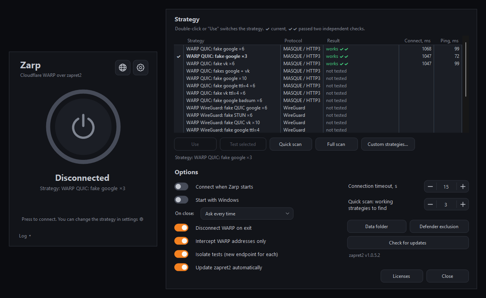

# Zarp

[](https://github.com/feg55/Zarp/actions/workflows/build.yml)
[](https://github.com/feg55/Zarp/releases/latest)
[](LICENSE)

One-click Cloudflare WARP for networks that block it. Zarp finds a [zapret2](https://github.com/bol-van/zapret2) strategy that gets the WARP handshake through DPI, remembers it and connects. The Windows version can also connect through your own VLESS, Trojan or Hysteria2 server, with routing rules and a choice of programs. Available for Windows, macOS and Android.



## Download

| Platform | Download | Requirements |
|---|---|---|
| **Windows** | [**Zarp.exe**](https://github.com/feg55/Zarp/releases/latest/download/Zarp.exe) · [all releases](https://github.com/feg55/Zarp/releases) | Windows 10/11 x64, administrator rights. [Cloudflare WARP](https://one.one.one.one/) is installed by Zarp if it is missing |
| **macOS** | [**DMG**](https://github.com/feg55/Zarp-MacOS/releases/latest) · [all releases](https://github.com/feg55/Zarp-MacOS/releases) · [source](https://github.com/feg55/Zarp-MacOS) | Apple Silicon (M1 or newer), macOS 14+, an administrator password once. No WARP app needed |
| **Android** | [**APK**](https://github.com/feg55/Zarp-Android/releases/latest) · [source](https://github.com/feg55/Zarp-Android) | Android 8.0+, no root, no WARP app needed |

[](https://github.com/feg55/Zarp/releases/latest)
[](https://github.com/feg55/Zarp-MacOS/releases/latest)
[](https://github.com/feg55/Zarp-Android/releases/latest)

## Features

- **One button.** The first click searches for the fastest working strategy, later clicks connect right away.
- **Built for WARP.** Strategies target the WARP handshake: MASQUE over QUIC (HTTP/3) and over TLS (HTTP/2).
- **Repeated checks.** Every candidate must pass twice, the second time on a different WARP endpoint when test isolation is on. A quick scan counts only confirmed strategies, and a connection counts only if traffic really goes through WARP.
- **Self-healing.** If the saved strategy stops working, Zarp tries the other verified ones before searching again.
- **Countries.** Filter the strategies by Russia, Iran and China, one or several at once, and tag your own strategies with countries. The filter covers the list, scans, auto-connect, rechecks and saved results.
- **Your own endpoints and server.** Pin WARP to the endpoints you list, or replace WARP with your own VLESS, Trojan or Hysteria2 link (TCP, WebSocket, gRPC, HTTPUpgrade, TLS, Reality, Vision, Salamander). The connection goes through the embedded [sing-box](https://github.com/SagerNet/sing-box) and carries TCP and UDP.
- **Routing and per-program proxy** (your own server). Presets for local networks, Russia, Iran and China, editable Direct, Proxy and Block rules (GeoIP, GeoSite, domains, IP ranges, regular expressions), downloadable V2Ray/Xray `.dat` databases, and a choice of the programs that use the server. See [connection settings](docs/connection-settings.md).
- **Zero setup.** A single `Zarp.exe` with zapret2 and sing-box embedded; zapret2 updates itself in the background. If Cloudflare WARP is missing, Zarp downloads the official client from Cloudflare and installs it after you agree.
- **Low overhead.** Only WARP addresses and handshake packets are intercepted. The tunnel itself never passes through zapret.
- **Your language.** English, Русский, Español, Português, 中文, हिन्दी, Français and Deutsch. Zarp follows the Windows language (English if it is not on the list), and the globe button switches it on the fly.

## Android

[Zarp for Android](https://github.com/feg55/Zarp-Android) brings the same one-tap flow to phones: the same strategies, double-checked tests, quick and full scan, and the same 8 languages. It works a little differently under the hood:

- **No WARP app needed.** Zarp talks to WARP itself over MASQUE and registers a free WARP device on first use.
- **No root.** It is a regular Android VPN. Fake packets are sent from the tunnel's own UDP socket right before the real handshake.
- **A subset of strategies.** Strategies that need raw sockets (badsum, md5 and similar) are shown as unsupported, WireGuard is not supported yet.

Download the APK from [Releases](https://github.com/feg55/Zarp-Android/releases/latest). The rest of this page is about the Windows version.

## Requirements

- Windows 10 or 11, x64
- Administrator rights (needed by the WinDivert driver)
- [Cloudflare WARP](https://one.one.one.one/): nothing to do, Zarp installs it for you when it is missing (see below). If you already have it, Zarp finds it wherever it is installed.

## Usage

1. Download [`Zarp.exe`](https://github.com/feg55/Zarp/releases/latest/download/Zarp.exe) and run it.
2. Press the power button. The first search takes a minute or two.
3. Done. Change the strategy any time in Settings.

**No Cloudflare WARP yet?** On the first press Zarp asks whether to install it. If you agree, it downloads the official installer from Cloudflare (about 60 MB), checks that it is signed by Cloudflare, installs it silently and carries on with the search. The WARP client is proprietary software that Cloudflare licenses to you, so Zarp does not bundle it: it fetches it from Cloudflare exactly as you would in a browser, and by installing it you accept the [Cloudflare WARP terms](https://www.cloudflare.com/application/terms/). If the Cloudflare download site is blocked for you, get `Cloudflare_WARP.msi` any other way (or install WARP yourself with `winget install Cloudflare.Warp`) and put the file into `%LOCALAPPDATA%\Zarp`; Zarp verifies its signature the same way and installs it.

Settings offer two searches. **Quick scan** (also used by the power button) stops after 3 working strategies; the number is adjustable. **Full scan** tests every strategy: slower, but nothing is skipped, so it finds the fastest one for sure.

**Server and endpoints**, **Routing** and **Per-app proxy** in Settings are described in [connection settings](docs/connection-settings.md). The short version: the official WARP client has no per-app mode and cannot route by country or domain, so routing and per-app proxy work with **your own server** (paste one link in **Server and endpoints** and switch it on), while the country filter and custom endpoints belong to WARP. The country filter and the routing presets are independent.

Closing the window asks whether to hide Zarp in the tray or quit. Select **Remember my choice** to make that action the default. Settings → **On close** lets you choose **Ask every time**, **Hide to tray** or **Exit the app**. **Exit** in the tray menu always quits.

> [!NOTE]
> **"Windows protected your PC"?** Older releases and local builds may be unsigned. Release signing requires maintainer setup; see [code signing](docs/code-signing.md). A trusted signature identifies the publisher, but new releases can still trigger SmartScreen while reputation builds. [Verify the download](#verify-the-download) before running it.

> [!NOTE]
> Turn off any other VPN (Happ, v2rayN, Clash, AmneziaVPN, ...) before searching. WARP traffic would go through its tunnel, so every test would measure that VPN instead of your network and no strategy would be found. Zarp warns you, asks before searching anyway, and never overwrites saved results with failures from such a run. Connecting with a strategy you already saved works either way.

> [!WARNING]
> Windows Defender may flag WinDivert as a hacktool. This is a known false positive. Zarp offers to add its zapret2 folder to Defender exclusions when that happens. The same offer is made for the sing-box folder if you use your own server and the antivirus blocks `sing-box.exe`.

Command line: `--connect` connects on start, `--autostart` starts minimized to tray (used by the autostart task).

### Verify the download

Every release is built by [GitHub Actions](.github/workflows/build.yml) straight from this repository. The release notes list the SHA-256 of `Zarp.exe`, and GitHub signs a build attestation for it:

```powershell
Get-FileHash .\Zarp.exe                                # compare with the release notes
gh attestation verify .\Zarp.exe --repo feg55/Zarp     # proves the file was built here
```

### What Zarp changes on your system

- If Cloudflare WARP is not installed and you agree, installs it from the official Cloudflare installer (Windows Installer, `msiexec /i ... /qn`). Nothing is installed without your consent. The installer is deleted afterwards.
- Runs as administrator. While a strategy is active, `winws2` from zapret2 loads the WinDivert driver and modifies only WARP handshake packets.
- Changes the tunnel protocol and MASQUE options of your WARP client through `warp-cli` to match the chosen strategy. During a search it also pins a WARP endpoint for each test and resets it to automatic afterwards (when you list your own endpoints, the connection stays pinned to the one that passed the check).
- Only if you use your own server: extracts sing-box (about 45 MB) to `%LOCALAPPDATA%\Zarp\singbox` and, while connected, creates a network adapter named `Zarp` that carries the system's traffic, with routes and firewall rules that keep DNS from bypassing it. They disappear when you disconnect, or when you exit with **Disconnect on exit** on (the default). The first time, Windows also installs the Wintun network driver that sing-box carries inside itself; the driver stays installed afterwards. If the antivirus blocks `sing-box.exe`, Zarp offers a Defender exclusion for that folder, as it does for zapret2.
- Extracts zapret2 and keeps its settings and log in `%LOCALAPPDATA%\Zarp`.
- Only if you turn them on: a Task Scheduler task named `Zarp` for **Start with Windows**, and a Windows Defender exclusion for the zapret2 folder, or for the sing-box folder if you use your own server (Zarp asks first).

### Uninstall

1. In Settings, turn off **Start with Windows** (or run `schtasks /Delete /TN Zarp /F`).
2. Choose **Exit** in the tray menu, then delete `Zarp.exe` and the `%LOCALAPPDATA%\Zarp` folder.
3. Restore the WARP defaults: `warp-cli tunnel protocol reset`, `warp-cli tunnel masque-options reset`, `warp-cli tunnel endpoint reset`.
4. If you added the Defender exclusion, remove it in an administrator PowerShell: `Remove-MpPreference -ExclusionPath "$env:LOCALAPPDATA\Zarp\zapret2"` (and the same for `...\Zarp\singbox` if you used your own server).
5. If you used your own server and want the Wintun network driver gone too, find its package with `pnputil /enum-drivers` (original name `wintun.inf`) and remove it with `pnputil /delete-driver <oemNN.inf> /uninstall`. Other VPN programs may use the same driver.
6. If Zarp installed Cloudflare WARP for you and you no longer need it, remove it like any program: Settings → Apps → **Cloudflare One Client** (called **Cloudflare WARP** in older versions), or `winget uninstall Cloudflare.Warp`.

### Privacy

Zarp does not collect, store or send any personal data, and it has no telemetry. It makes only these network requests:

- `https://www.cloudflare.com/cdn-cgi/trace`, while testing or connecting, and every 15 seconds while WARP is connected, to check that traffic goes through WARP and to measure latency. With your own server the same page is requested through the server.
- Only if you use your own server: the connection to that server. Its link, with the password, is kept in `zarp.json` in your data folder and never written to the log.
- Only if you press Download in **GeoIP and GeoSite**: the address you set there. By default these are `https://github.com/Loyalsoldier/v2ray-rules-dat/releases/latest/download/geoip.dat` and `.../geosite.dat`.
- `https://downloads.cloudflareclient.com/`, only if Cloudflare WARP is missing and you agreed to install it, to download the official installer.
- `https://github.com/bol-van/zapret2/releases` (the GitHub API as a fallback), to check for and download zapret2 updates. Turn off **Update zapret2 automatically** in Settings to disable this.

WARP itself is a Cloudflare service covered by the [Cloudflare WARP privacy policy](https://www.cloudflare.com/application/privacypolicy/). Requests to GitHub are covered by the [GitHub privacy statement](https://docs.github.com/en/site-policy/privacy-policies/github-general-privacy-statement).

## How it works

A strategy is a WARP tunnel protocol plus a winws2 profile. During the search Zarp starts winws2 for each strategy, connects WARP via `warp-cli`, waits for `Connected` and checks `cdn-cgi/trace` for `warp=on`. Score is `connect time + 4 × ping`. The fakes are real packets from services that are not blocked (QUIC/TLS for google, vk and gosuslugi), because DPI ignores empty fakes.

With your own server there is no strategy to find: Zarp checks the server twice with a real HTTPS request, then starts sing-box with a network adapter that carries the system's traffic, applying your routing rules and program selection. Details are in [connection settings](docs/connection-settings.md).

The built-in strategies and where their syntax comes from are described in [docs/strategies.md](docs/strategies.md).

App data lives in `%LOCALAPPDATA%\Zarp`: settings, log, extracted zapret2 and sing-box (`singbox`), downloaded GeoIP and GeoSite databases (`geodata`) and `strategies.txt` for your own strategies:

```
# name | transport (h3, h2, wg) | winws2 profile args | countries (optional)
My QUIC | h3 | --payload=quic_initial --lua-desync=fake:blob=quic_google:repeats=8
My TLS  | h2 | --payload=tls_client_hello --lua-desync=multisplit:pos=1,sld | ru,ir,cn
```

See the [zapret2 manual](https://github.com/bol-van/zapret2/blob/master/docs/manual.en.md) for `--lua-desync` syntax.

## Building

```powershell
.\build.ps1 -Version 1.0.0   # dist\Zarp.exe
```

Requires the .NET SDK 6 or later (the target is .NET Framework 4.8). `tools/fetch-zapret.ps1` packs the latest zapret2 release into `vendor/zapret2.zip`, and `tools/fetch-singbox.ps1` packs the pinned sing-box release (its SHA-256 is checked) into `vendor/singbox.zip`; both get embedded into the exe, which makes it about 18 MB. Without `vendor/singbox.zip` the build works but your own server mode reports that sing-box is missing.

GitHub Actions builds every push. A `v*` tag publishes `Zarp.exe`; releases are unsigned until [SignPath is configured](docs/code-signing.md) and the repository variable `SIGNPATH_ENABLED` is set to `true`. Once signing is enabled, a missing configuration or invalid signature stops the release. Release notes report the signing status.

UI regression checks (Windows; no WARP/WinDivert changes). They open every window in every language and fail on clipped or overlapping text, they run every built-in strategy through the real `winws2 --dry-run`, which parses the parameters without intercepting anything, and they start real VLESS, Trojan and Hysteria2 servers on localhost (no network adapter) to check the server mode and the routing rules:

```powershell
dotnet build tests/Zarp.Tests/Zarp.Tests.csproj -c Release -o build/tests
.\build\tests\Zarp.Tests.exe --results build/test-results
```

Tests run independently and continue after failures. GitHub Actions shows the failed cases in the run summary and uploads the `zarp-test-results` artifact even when tests fail. It includes JUnit XML, stdout/stderr, exit codes and the exact winws2 configurations. See [test reporting and targeted runs](docs/testing.md).

### Translations

All UI strings live in [`src/Zarp/Lang`](src/Zarp/Lang), one `key = value` file per language, with `en.txt` as the reference. To fix a translation, edit the file. To add a language, copy `en.txt` to `<code>.txt`, translate the values and add the code to `L.Languages` in [`L.cs`](src/Zarp/Core/L.cs). The tests check that every language has the same keys and placeholders as English.

## Code signing policy

Free code signing provided by [SignPath.io](https://signpath.io), certificate by [SignPath Foundation](https://signpath.org).

- Committers and reviewers: [feg55](https://github.com/feg55)
- Approvers: [feg55](https://github.com/feg55)
- Privacy policy: see [Privacy](#privacy)

Only `Zarp.exe` built by GitHub Actions from this repository is signed, and every signing request is approved manually. The bundled zapret2 and WinDivert files are unmodified upstream binaries, listed in [THIRD_PARTY_NOTICES.md](THIRD_PARTY_NOTICES.md). Signing starts with the first release after the SignPath Foundation application is approved; earlier releases are unsigned.

## License

Zarp for Windows is released under the [MIT License](LICENSE). [Zarp for Android](https://github.com/feg55/Zarp-Android) is a separate project under GPL-3.0.

`Zarp.exe` bundles [zapret2](https://github.com/bol-van/zapret2) (MIT) with LuaJIT (MIT) and zlib, [WinDivert](https://reqrypt.org/windivert.html) (LGPL-3.0), the Cygwin DLL (LGPL-3.0-or-later) and [sing-box](https://github.com/SagerNet/sing-box) (GPL-3.0-or-later, started as a separate program, with the [Wintun](https://www.wintun.net/) driver inside it under the Wintun Prebuilt Binaries License), plus country IP ranges from [ipverse/country-ip-blocks](https://github.com/ipverse/country-ip-blocks) (CC0). See [THIRD_PARTY_NOTICES.md](THIRD_PARTY_NOTICES.md) for versions, license texts and source links.

Cloudflare and WARP are trademarks of Cloudflare, Inc. Zarp is an independent project, not affiliated with or endorsed by Cloudflare. Zarp does not bundle or redistribute any Cloudflare software: it only drives the WARP client through `warp-cli`, and when the client is missing it fetches the official installer from Cloudflare on your request.
